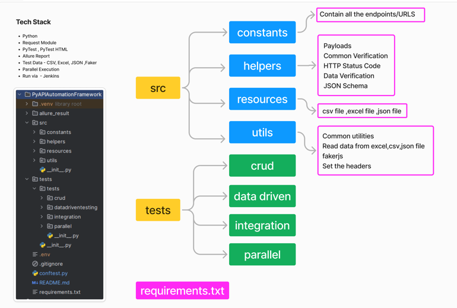
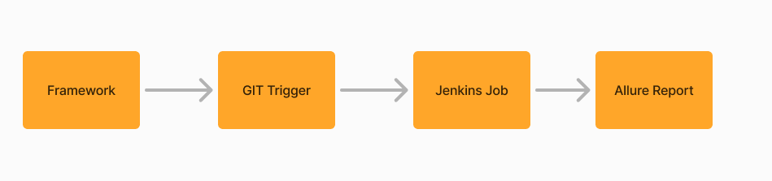

## Python API Automation Framework

### Hybrid Custom Framework to Test the REST APIs



### Tech Stack
 - Python 3.12
 - Requests Module- HTTP Requests
 - PyTest - Testing Framework
 - Reporting - Allure Report, PyTest HTML
 - Test Data - CSV, Excel, JSON, Faker
 - Advance API Testcase - jsonschema
 - Parallel Execution - x distribute (xdist)
 - Allure Report

### How to Install Packages

```pip install requests pytest pytest-html faker allure-pytest jsonschema```

### To Freeze your Package version
`` pip freeze > requirements.txt ``

### To Install the Freeze Version
``pip install -r requirements.txt``

### How to run your Testcase Parallel

```pip install pytest-xdist```

### How to add the .gitignore File?

Copy the content from this to .gitignore file https://www.toptal.com/developers/gitignore/api/pycharm+all

### How to run the Basic Test with Allure report

```pytest tests/tests/crud/test_create_booking.py --alluredir=allure_result -s```

### How to run via Jenkins(CI/CD)



- Jenkins Run Process
- Install the Jenkins - jenkins download
- Install the JDK (open JDK) https://jdk.java.net/21/
- Set it into the Global Config - http://localhost:8080/manage/configureTools/
- Install the Plugins - http://localhost:8080/manage/pluginManager/
  - Allure
  - HTML Report
- GITHUB - Repo - https://github.com/vimalsurani/PyAPIAutomationFramework.git

## Build and Test Automation

```batch
@echo off

:: Set the Python path
set "PYTHON_PATH=C:\Program Files\Python311"
set "SCRIPTS_PATH=%PYTHON_PATH%\Scripts"
set PATH=%PATH%;%PYTHON_PATH%;%SCRIPTS_PATH%

:: Install dependencies
pip install -r requirements.txt

:: Run tests and generate Allure results
pytest tests/tests/crud/test_create_booking.py --alluredir=allure-results

:: Check if the allure-results directory exists
if exist "allure-results" (
    echo "Generating Allure report..."
    C:\ProgramData\Jenkins\.jenkins\tools\ru.yandex.qatools.allure.jenkins.tools.AllureCommandlineInstallation\Allure\bin\allure.bat generate "allure-results" -c -o "allure-report"
    echo "Allure report generated."
) else (
    echo "No allu
